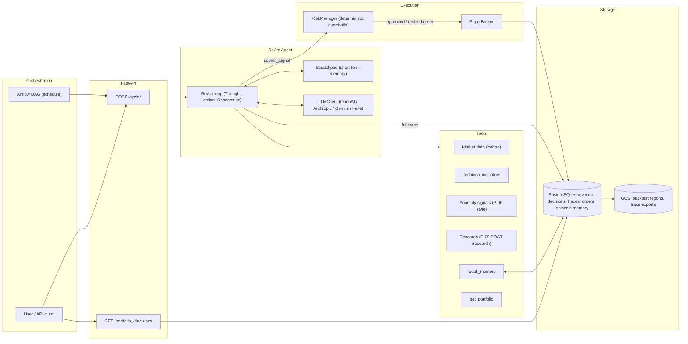

# Autonomous Trading Analyst

> **Draft (Day 0).** Architecture proposal; modules are implemented issue by issue
> (see [`docs/roadmap.md`](docs/roadmap.md)).

An autonomous **ReAct agent** (Thought → Action → Observation) that, on a fixed schedule or on
demand, analyzes a watchlist, decides **BUY / SELL / HOLD** signals (with position size,
confidence and cited reasoning) and executes them in a **simulated paper-trading portfolio**.
It measures its own results and learns from past decisions through long-term memory.

> [!CAUTION]
> **Paper trading only.** This project never connects to a real broker and never uses real
> money. `TRADING_MODE` accepts only `paper`, and no live-broker interface exists by design.

## Ecosystem

| Project | Reused as |
|---|---|
| P-01 Financial Markets Pipeline | Yahoo Finance market data approach |
| P-06 Asset Anomaly Detection | Anomaly-signal tool (rolling z-score style) |
| P-09 Financial Research Agent | `POST /research` as the fundamental-research tool; multi-provider LLM abstraction |

P-09 is an agent that *researches and reports*; P-10 is an agent that **decides, acts and
remembers**.

## Architecture



### Decision flow (one ticker, one cycle)
1. The cycle loads the watchlist and the current portfolio state.
2. The agent runs an explicit ReAct loop: it reasons, calls tools (market data, indicators,
   anomalies, P-09 research, similar past episodes from memory) and records every step in the
   scratchpad.
3. It ends by calling `submit_signal` with `action`, `size`, `confidence`, `rationale` and
   `citations` that must reference real observation IDs from the trace.
4. The deterministic `RiskManager` approves, resizes or rejects the order (max position size,
   max gross exposure, stop-loss, max trades per day, watchlist-only, no shorting/leverage).
5. The `PaperBroker` fills it with slippage and commission and updates cash, positions and PnL.
6. The decision, its full trace (thoughts, tool calls, observations, tokens, cost) and the order
   are persisted; the episode is embedded into episodic memory.
7. Later, outcome reflection scores past decisions with realized returns and writes the result
   back into memory, so future recalls carry "what happened next".

### Planned module layout

```
src/autonomous_trading_analyst/
├── config.py          # Typed settings (pydantic-settings); TRADING_MODE = paper only
├── domain/            # Signal, Order, Fill, Position, PortfolioState, TraceStep, DecisionRecord
├── tools/             # Market data, indicators, anomalies, P-09 research client, ToolRegistry
├── llm/               # Provider-agnostic LLMClient, providers, fake, pricing
├── agent/             # Scratchpad, trace recorder, ReAct loop, prompts
├── memory/            # Embeddings, pgvector episodic memory, outcome reflection
├── risk/              # Deterministic RiskManager
├── broker/            # PaperBroker (the only broker)
├── persistence/       # SQLAlchemy schema and repositories
├── evaluation/        # Metrics, baselines, point-in-time backtest, reports
├── storage/           # ArtifactStore (local fake + GCS)
├── api/               # FastAPI app
└── cycle.py           # Analysis cycle orchestrator
dags/                  # Airflow DAG (thin HTTP trigger of POST /cycles)
infra/                 # Terraform (GCS bucket)
tests/unit, tests/integration
```

### Key design principles
- **Agent proposes, risk disposes**: guardrails are deterministic code executed after the LLM.
- **Traceable by construction**: every step of every decision is stored and queryable.
- **Fakes everywhere**: every external integration (LLM, embeddings, market data, P-09, GCS)
  has an interface and a fake, so the suite runs offline and deterministically.
- **Evaluation first-class**: point-in-time backtest of the agent vs buy & hold and an
  SMA-crossover rule, reporting total return, Sharpe, max drawdown, win rate and cost per
  decision.

## Tech stack
Python 3.12+, Pydantic, LLM function calling (OpenAI / Anthropic / Gemini), PostgreSQL +
pgvector, SQLAlchemy, pandas, yfinance, FastAPI, Airflow, Docker Compose, GitHub Actions,
Google Cloud Storage, Terraform.

## Quickstart

```bash
make venv          # create .venv
make deps          # install the package with all extras + dev tools
cp .env.example .env
make ci            # lint + typecheck + tests
make help          # list every target
```

## Project status
Day 0 scaffolding. Milestones and issues: [`docs/roadmap.md`](docs/roadmap.md).
Workflow rules: [`.agents/rules/workflow.md`](.agents/rules/workflow.md).
